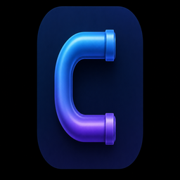

<p align="center">
  
</p>

<h1 align="center">Conduit</h1>

<p align="center">
  Windows desktop utility: local HTTP CONNECT proxy with TLS ClientHello fragmentation and an embedded YouTube viewer (Wails v3 / WebView2).
</p>

<p align="center">
  <a href="https://github.com/foursecondfivefour/conduit/releases/latest"></a>
  <a href="https://github.com/foursecondfivefour/conduit/actions/workflows/ci.yml"></a>
  <a href="LICENSE"></a>
</p>

Designed for a small footprint: one WebView window, mobile YouTube UI, system-tray settings. Release builds run without a console window.

## Download

Pre-built Windows binary (amd64): **[Latest release](https://github.com/foursecondfivefour/conduit/releases/latest)** — download `conduit.exe`, then run it. Requires [WebView2 Runtime](https://developer.microsoft.com/microsoft-edge/webview2/).

## Requirements

- Windows 10 (amd64)
- [Go 1.25+](https://go.dev/dl/) (to build from source)
- [Microsoft Edge WebView2 Runtime](https://developer.microsoft.com/microsoft-edge/webview2/)

## Build

```powershell
go generate ./...   # embeds assets/windows/icon.ico into the .exe (needs go-winres)
go build -ldflags="-s -w -H=windowsgui" -tags production -o build\conduit.exe .
```

`-H=windowsgui` hides the console window in release builds. `rsrc_windows_amd64.syso` is checked in so a plain `go build` also works on Windows amd64 (add the same ldflags for a GUI subsystem).

## Run

```powershell
.\build\conduit.exe
```

1. A short splash screen appears while Conduit starts.
2. On first launch, a guided onboarding tour explains proxy, DPI strategies, and the tray menu.
3. Proxy listens on `127.0.0.1:31284` (or the next free port).
4. A YouTube window opens (`https://m.youtube.com`).
5. Tray icon: DPI strategy, DNS cache reset, **Обучение**, quit.

### Proxy only (lowest RAM)

```powershell
.\build\conduit.exe -no-gui
```

Point your browser at `http://127.0.0.1:31284`.

## Verify proxy

```powershell
curl.exe -x http://127.0.0.1:31284 https://www.youtube.com -I
```

## Architecture

```
WebView2 → CONNECT proxy → DoH DNS → TCP:443
                ↓
      TLS ClientHello fragmentation (first write only)
```

The proxy binds to `127.0.0.1` and allows only YouTube/Google media domains.

## Tests

```powershell
go test ./...
```

## Disclaimer

Network filtering and circumvention may be regulated in your jurisdiction. You are responsible for compliance with local law. This project is provided as-is without warranty.

## License

MIT — see [LICENSE](LICENSE).
